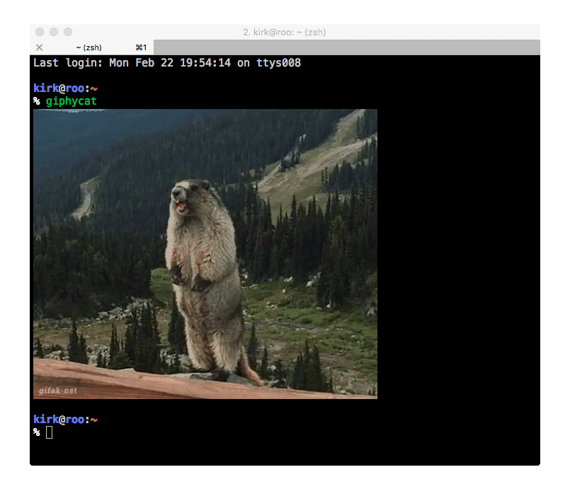

# giphycat - Giphy fun for iTerm2

OS X's [iTerm2](https://iterm2.com) terminal emulator supports inline images. Obviously, there has to be a Giphy command line client to properly take advantage of this:

# Installation

giphycat requires either Python 2.7 or Python 3.5+ (and possibly earlier versions of Python 3, although they haven't been tested). Use pip to install it:

`$ pip install giphycat`

# Usage

When run with no arguments, `giphycat` fetches a random image from Giphy and displays it in the terminal:

`$ giphycat`
 

Any other arguments are treated as a search phrase, and `giphycat` will return one of the images for that phrase at random:

`$ giphycat boston terrier`
 

`$ giphycat creqcrqwrceqwrceqwrq`
 `Unable to find any GIFs for 'creqcrqwrceqwrceqwrq'`

# Copyright

giphycat is &copy;2016 by Kirk Strauser <kirk@strauser.com>.

# License

giphycat is distributable under the terms of the MIT License.
